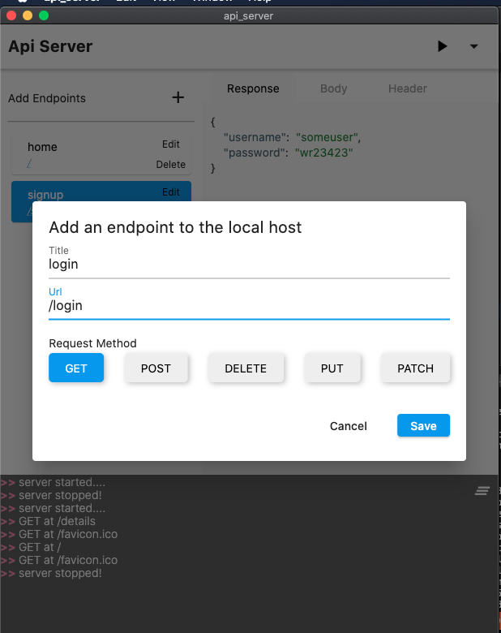
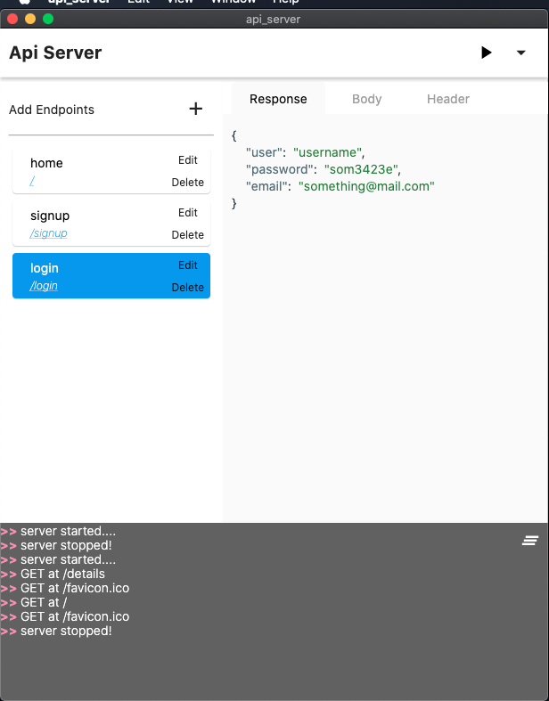
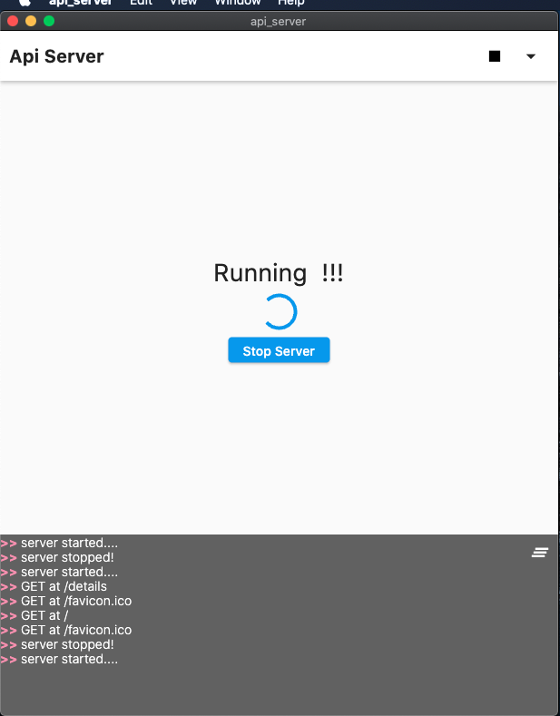

# API SERVER

An api server for frontend developers. This application builds a local mock server for your specified endpoints and response.

> Are you working with a team of engineers still in the process of setting up a backend for your frontend project. But you need a frontend server to test your designs and see if everything goes as predicted. Then this application is for you.
> Just make use of a simple to use GUI panel to setup a server that returns a response based on the rules you specify. And then you can go on with your project without worrying about when the backend guys get done with the actual server 😉.

# Preview

## Screenshots
,,

## how to use
1. download the version for your os. Install and you are good to go
    Nb: this feature is not available yet as this project is not yet usable for any os at the moment :(
2. Click on the button to add an api endpoint
3. Specify a title and the url for the endpoint
4. Click on save to add this to the list of endpoints
5. After adding all your required endpoints, click on the 'play' or 'run' button at the top of the app
6. The application builds your server and runs it on the `localhost` port `80`

## Goals
build a server that is easy to setup and runs on multiple devices

### Aims
build a completely stateless app

follow flutter best practices

setup ci/cd for the project

# Tasks
- [x] Build the User interface on home page
- [x] Link server to the frontend
- [x] Add Error response tab on json editor
- [ ] Add method type indicator on endpoint list widget
- [ ] Setup Ci/Cd for building macos, web and linux apps 
- [ ] Build the User interface for settings page
- [ ] Build the User interface for help page
- [ ] Build the User interface for the about page
- [ ] Add instructions on how to use the app in the about page
- [ ] Add link for contribution to the project 
- [ ] Setup test for headers and authorizations to endpoints
- [ ] Setup the body for request
