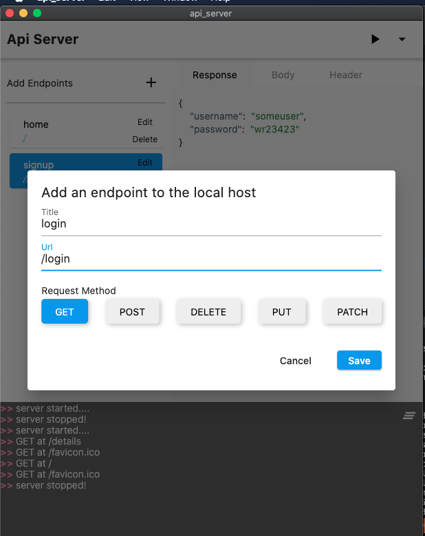
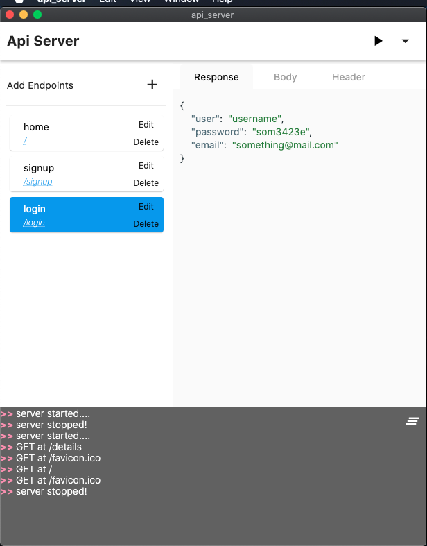
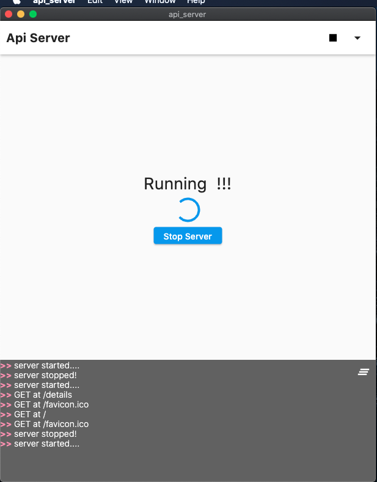

<div align="center">


# API Server

**A local mock API server with a GUI — build and run fake endpoints for frontend development, no backend required.**

[](https://github.com/AnthonyAniobi/Api_Server/releases/latest)
[](https://github.com/AnthonyAniobi/Api_Server/actions/workflows/desktop-release.yml)
[](https://github.com/AnthonyAniobi/Api_Server/issues)
[](https://github.com/AnthonyAniobi/Api_Server/network/members)
[](https://github.com/AnthonyAniobi/Api_Server/stargazers)
[](LICENSE)

[Download](#download) · [Usage](#usage) · [Build from source](#build-from-source) · [Roadmap](#roadmap)

</div>

---

## About

Are you working with a team of engineers while the backend for your frontend project is still being built? **API Server** gives you a simple GUI to spin up a local mock server that returns responses based on rules you define — so you can keep building and testing your UI without waiting on the "backend guys" to finish. 😉

Available for **macOS**, **Windows**, and **Linux**.

## Features

- 🖥️ Cross-platform desktop app (macOS, Windows, Linux)
- ⚡ Define endpoints with custom titles, URLs, methods, and JSON responses
- ▶️ Start/stop your mock server locally with one click
- 📥 Import endpoints directly from an OpenAPI specification
- 🧩 Built-in JSON editor for shaping request/response payloads

## Preview

<p align="center">
  
  
  
</p>

## Download

Grab the latest build for your operating system from the [**Releases**](https://github.com/AnthonyAniobi/Api_Server/releases/latest) page.

| Platform | Download | Notes |
|---|---|---|
| 🍎 macOS | `api-server-macos.zip` | Unzip and move `api_server.app` to `Applications`. See [note](#macos-gatekeeper) below on first launch. |
| 🪟 Windows | `api-server-windows-x64.zip` | Unzip and run `api_server.exe`. See [note](#windows-smartscreen) below on first launch. |
| 🐧 Linux | `api-server-linux-x64.zip` | Unzip and run the `api_server` executable. |

#### macOS Gatekeeper

The app isn't code-signed/notarized yet, so macOS may block it on first launch. Right-click the app → **Open** → **Open** again to bypass the warning, or run:

```bash
xattr -cr /Applications/api_server.app
```

#### Windows SmartScreen

Windows may show a "Windows protected your PC" prompt since the binary isn't code-signed. Click **More info** → **Run anyway** to continue.

## Usage

1. Download and install the app for your OS (see [Download](#download)).
2. Click the **add endpoint** button.
3. Specify a title, method, and URL for the endpoint.
4. Use the JSON editor to define the response body (and error responses, if needed).
5. Click **save** to add it to your list of endpoints — or import a full set at once from an OpenAPI spec.
6. Once you've added all the endpoints you need, click the **play/run** button at the top of the app.
7. The app builds your server and serves your endpoints from `localhost`.

## Build from source

**Requirements:** [Flutter SDK](https://docs.flutter.dev/get-started/install) `>=3.3.0`, with desktop support enabled for your target platform.

```bash
# Clone the repo
git clone https://github.com/AnthonyAniobi/Api_Server.git
cd Api_Server

# Install dependencies
flutter pub get

# Generate code (json_serializable / build_runner)
flutter pub run build_runner build --delete-conflicting-outputs

# Run in debug mode
flutter run -d macos    # or: windows / linux

# Build a release binary
flutter build macos --release   # or: windows / linux
```

## Releases

Every push of a `v*.*.*` tag triggers [`.github/workflows/desktop-release.yml`](.github/workflows/desktop-release.yml), which builds the app for macOS, Windows, and Linux, then publishes a GitHub Release with all three artifacts attached. See past builds under [Releases](https://github.com/AnthonyAniobi/Api_Server/releases).

## Roadmap

- [x] Build the user interface on the home page
- [x] Link the server to the frontend
- [x] Add error response tab to the JSON editor
- [x] Add method type indicator on the endpoint list widget
- [x] Set up CI/CD for building macOS, Windows, and Linux apps
- [x] Set up flow for building endpoints from an OpenAPI schema
- [ ] Set up app icon and installation requirements for Windows, Linux, and macOS
- [ ] Build the user interface for the settings page
- [ ] Build the user interface for the help page
- [ ] Build the user interface for the about page
- [ ] Build the user interface for all profiles
- [ ] Set up saving endpoints to device
- [ ] Add in-app usage instructions on the about page
- [ ] Add a contribution link/guide
- [ ] Set up tests for headers and authorization on endpoints
- [ ] Set up request body support

## Contributing

Issues and pull requests are welcome! If you'd like to help move an item on the [roadmap](#roadmap) forward, open an issue first to discuss the approach.

## License

Distributed under the [MIT License](LICENSE).
